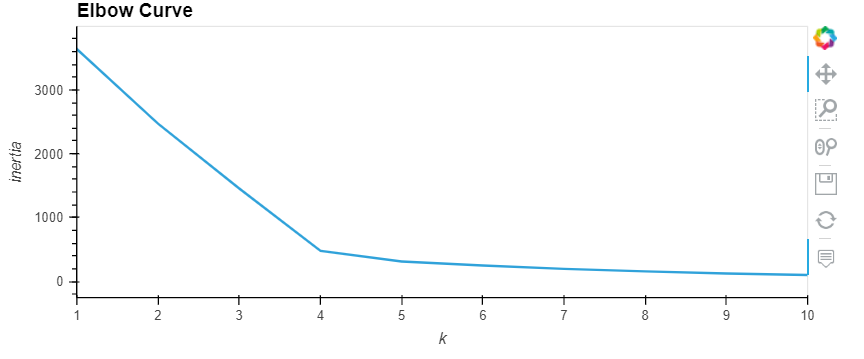
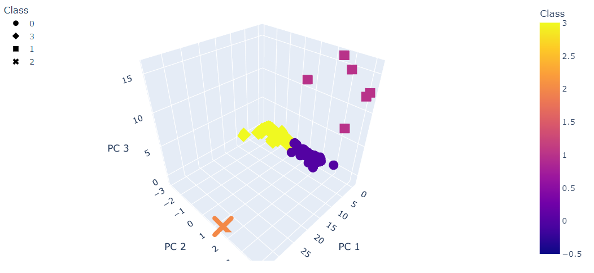
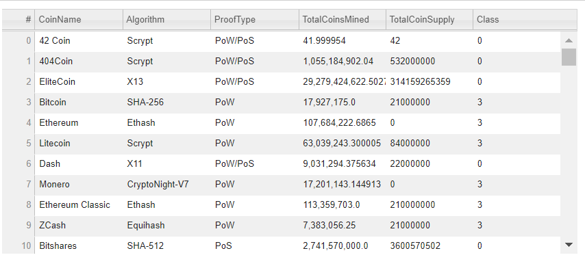
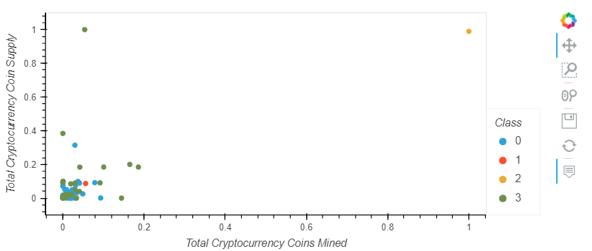

# Cryptocurrencies
## Overview
The purpose of this analysis is to create an analysis for clients who are preparing to get into the cryptocurrency market. Deliverables include:
- Preprocessing the Data for PCA
- Reducing Data Dimensions Using PCA
- Clustering Cryptocurrencies Using K-means
- Visualizing Cryptocurrencies Results

---
## Results 
###  Elbow Curve

### 3D Scatter Plot

### Tradable Cryptocurrencies 

### HV Plot 

